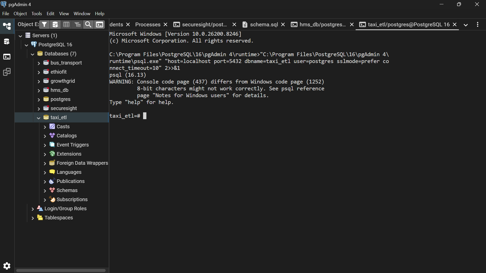
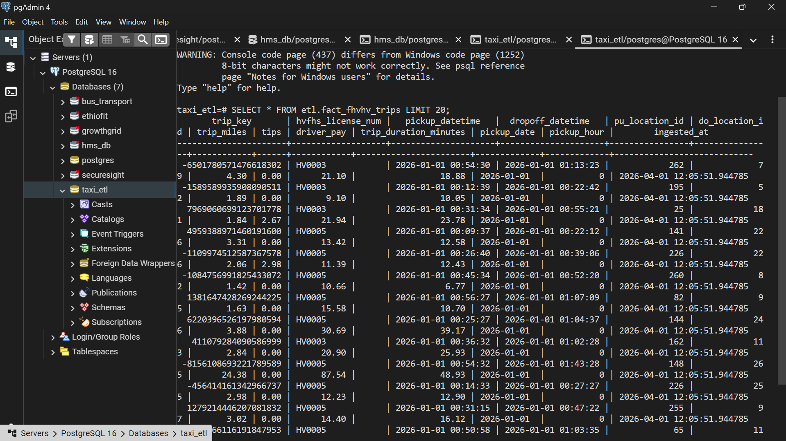
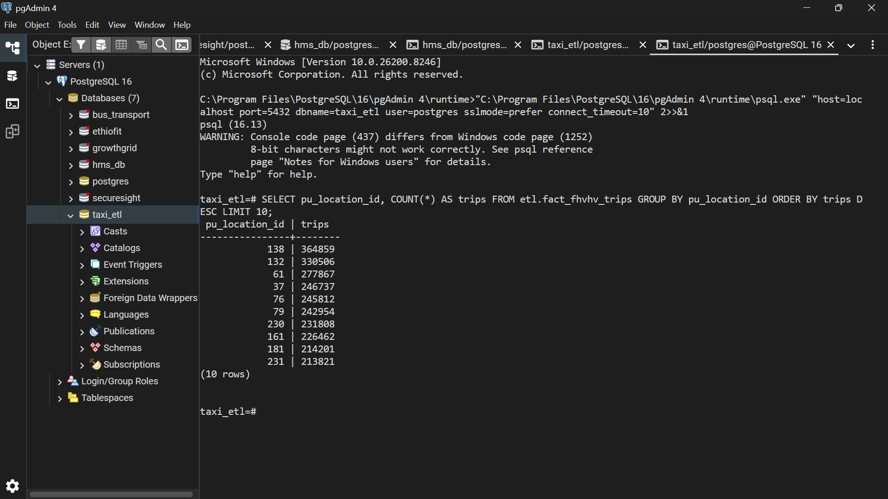
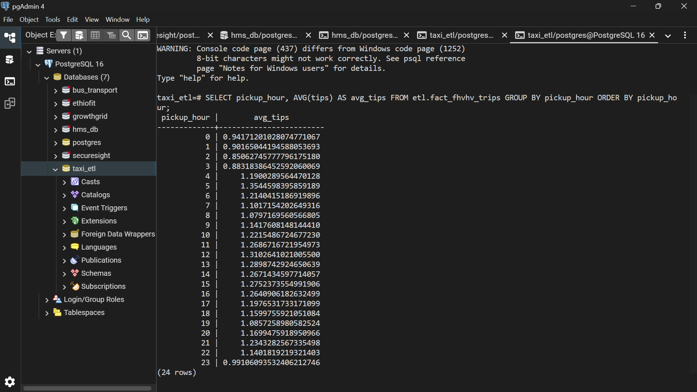
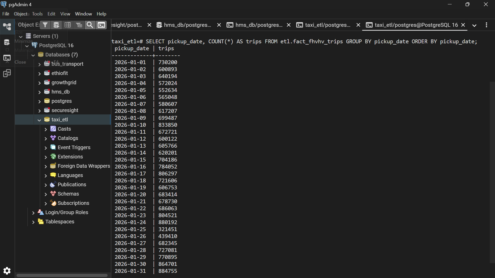
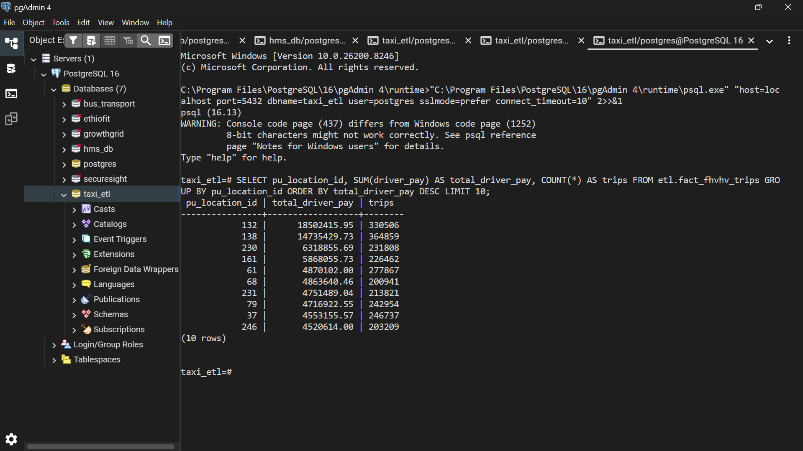
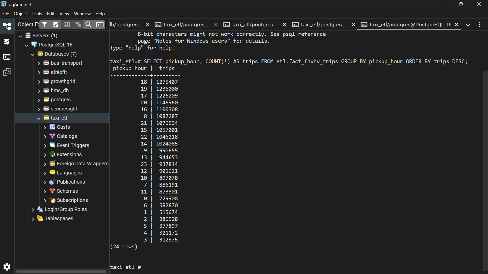
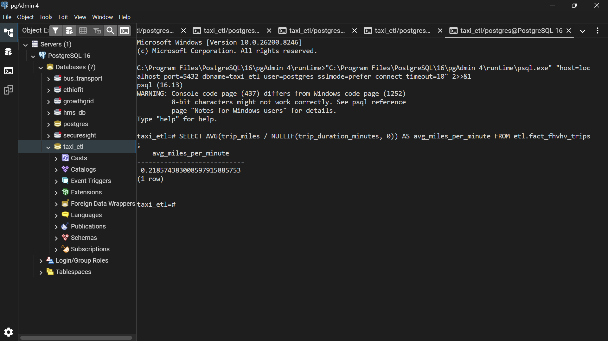

## NYC Taxi ETL (Pandas → PostgreSQL)

This project implements an end-to-end ETL pipeline for NYC TLC **FHVHV trip data** (For-Hire Vehicle High Volume), using:

- **Extract**: read a Parquet dataset (millions of trip records)
- **Transform**: clean invalid trips, derive analytics columns (duration/date/hour), and create a deterministic `trip_key` for deduplication
- **Load**: bulk-load into **PostgreSQL** using `COPY` into a staging table, then insert into an analytics-ready fact table

### Business scenario
A ride-hailing marketplace wants to monitor operational performance (trip distance/duration), driver earnings (`driver_pay`), and customer tips (`tips`) across time and pickup/dropoff zones.

---

## Dataset
Default input file (**~20.9M rows**):

- `data/raw/fhvhv_tripdata_2026-01.parquet`

You can point to a different Parquet file by setting `DATA_PATH` in `.env`.

---

## PostgreSQL schema
The schema is defined in `sql/schema.sql` and creates:

- `etl.stg_fhvhv_trips` (staging; fast loads)
- `etl.fact_fhvhv_trips` (fact table; deduped on `trip_key` + indexed for analytics)

---

## Setup
1) Create a PostgreSQL database (example):

```sql
CREATE DATABASE taxi_etl;
```

2) Create a `.env` file from the example:

- Copy `nyc-taxi-etl/.env.example` to `nyc-taxi-etl/.env`
- Fill in `PGPASSWORD` (and adjust host/port/user/db if needed)

3) Install dependencies:

```bash
pip install -r requirements.txt
```

---

## Run the pipeline
From the `nyc-taxi-etl` folder:

```bash
python -m src.pipeline --init-db
```

Re-running is safe: rows are deduplicated using `trip_key` (`ON CONFLICT DO NOTHING`).

---

## Screenshots / evidence (recommended)
PostgreSQL can’t “take a screenshot”, but you can run queries and screenshot the results (pgAdmin or `psql`).

1) Take the screenshot:

- Select area (best): `Win + Shift + S`
- Active window: `Alt + PrtScn`

Tip: for `psql`, you can turn on a nicer output format:

```sql
\x on
\pset pager off
```

---

## Sample screenshots
These screenshots are saved in `nyc-taxi-etl/screenshot/`:

**Database connection**



**Sample rows (LIMIT 20)**



**Top pickup zones**



**Average tips by hour**



**Daily trips trend**



**Top earning pickup zones**



**Peak hours**



**Miles per minute (efficiency)**



---

## Example analytics queries
Top pickup zones by trip count:

```sql
SELECT pu_location_id, COUNT(*) AS trips
FROM etl.fact_fhvhv_trips
GROUP BY 1
ORDER BY trips DESC
LIMIT 10;
```

Average tips by pickup hour:

```sql
SELECT pickup_hour, AVG(tips) AS avg_tips
FROM etl.fact_fhvhv_trips
GROUP BY 1
ORDER BY 1;
```

# Group 2 – Team Members

members of Group 2:

1. Ayele Yinesu
2. Hana Shegawered
3. Eyerusalem Habtegebreal
4. Eyosyas Yoseph
5. Bantalem Mitiku
6. Yonas Tilahun
7. Addisu Guche
8. Eden Sebsbe

